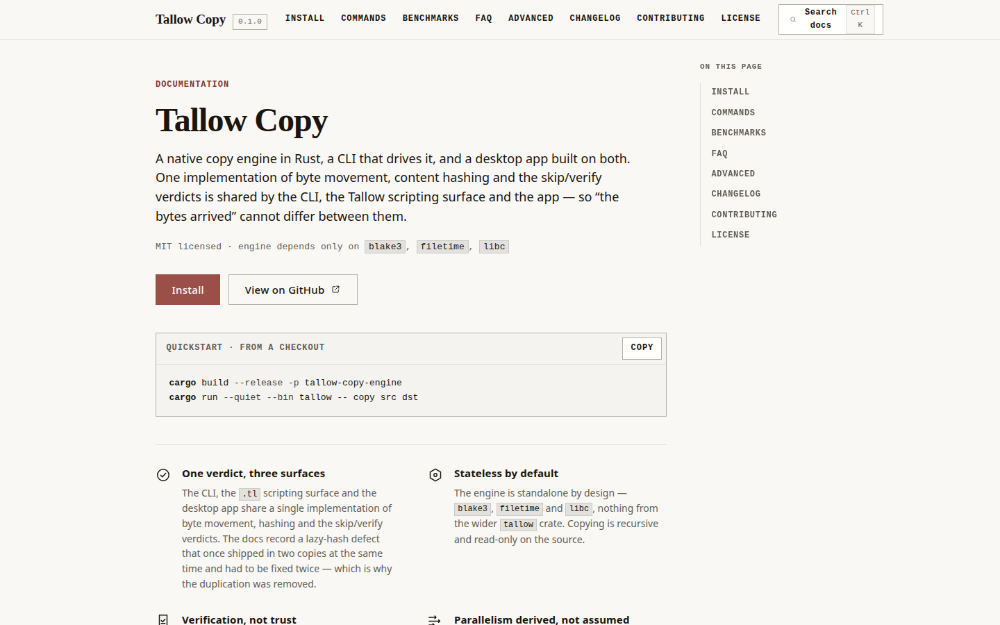

<div align="center">

# Tallow Copy

The `tallow` CLI's copy surface — `copy`, `delta-sync` and `verify-transfer` — on one implementation of
byte movement, content hashing and the skip/verify verdicts, shared with the Tallow scripting surface
and the desktop app.

[](https://github.com/aamirmanisa/tallow-copy/releases/tag/v0.1.1)


[](https://github.com/aamirmanisa/tallow-copy/actions/workflows/tallow-copy-build.yml)

**[Documentation](https://aamirmanisa.github.io/tallow-copy/)** &nbsp;·&nbsp; **[Download](https://github.com/aamirmanisa/tallow-copy/releases/latest)** &nbsp;·&nbsp; [Command reference](https://aamirmanisa.github.io/tallow-copy/#commands) &nbsp;·&nbsp; [Benchmarks](https://aamirmanisa.github.io/tallow-copy/#benchmarks)



</div>

---

One implementation of byte movement, content hashing and the skip/verify verdicts is shared by the CLI, the Tallow scripting surface and the app — so *"the bytes arrived"* cannot differ between them. The engine is standalone: `blake3`, `filetime`, `libc`, nothing else.

## Quickstart

The CLI is Tallow's copy surface - `tallow copy <SRC> <DST>`, with `delta-sync` and
`verify-transfer` beside it. The desktop app is a separate package, further down.

On Debian or Ubuntu, from the release:

```bash
sudo apt install ./tallow-copy_0.1.1_amd64.deb
```

## Download

CI builds and bundles every platform on each push. Signed by nobody — see [Signing](#signing).

| Platform | Files |
|---|---|
| Linux x86_64 | [`tallow-copy_0.1.1_amd64.deb`](https://github.com/aamirmanisa/tallow-copy/releases/latest) · [`tallow-copy_0.1.1_amd64.AppImage`](https://github.com/aamirmanisa/tallow-copy/releases/latest) |
| Windows x86_64 | [`tallow-copy_0.1.1_x64_en-US.msi`](https://github.com/aamirmanisa/tallow-copy/releases/latest) · [`tallow-copy_0.1.1_x64-setup.exe`](https://github.com/aamirmanisa/tallow-copy/releases/latest) |
| macOS Intel | [`tallow-copy_0.1.1_x64.dmg`](https://github.com/aamirmanisa/tallow-copy/releases/latest) · `.app.tar.gz` |
| macOS Apple silicon | [`tallow-copy_0.1.1_aarch64.dmg`](https://github.com/aamirmanisa/tallow-copy/releases/latest) · `.app.tar.gz` |

Every asset carries a SHA-256 in its [release notes](https://github.com/aamirmanisa/tallow-copy/releases/tag/v0.1.1). The AppImage needs FUSE; without it, run it with `APPIMAGE_EXTRACT_AND_RUN=1`.

## Command reference

Every row verified against the live binary. `tallow` is Tallow's CLI; these are its copy-surface subcommands.

| Command | What it does |
|---|---|
| `tallow copy <SRC> <DST>` | Copy missing or changed entries. Recursive, read-only on the source. `--resume` continues an interrupted file from its deterministic `.name.tallow-partial` sibling. |
| `tallow delta-sync <SRC> <DST>` | Stateful one-way reconciler — a different capability from the stateless copier. Keeps SQLite state to decide what changed. |
| `tallow verify-transfer --source <SRC> --target <DST>` | Read-only comparison: what is missing, what differs, what is extra. Writes nothing. |
| `tallow manifest-create` | Write a manifest — `path<TAB>size<TAB>blake3` behind `# nixe manifest v1` — so a tree can be verified on a machine that never had the source. |
| `tallow manifest-verify --manifest <M> <ROOT>` | Verify a tree against a manifest. `extra` entries are reported and **never deleted**. |

## Verification, not trust

| Verify mode | What it proves |
|---|---|
| `none` | Nothing. The copy is attempted. |
| `size` | Size + mtime. Cheap, and honest about what it does not check. |
| `sampled_hash` | Hashes a sample rather than the whole tree. |
| `full_hash` | Hashes both sides. |
| `read_after_write` | Reads back what it wrote. |
| `manifest` | Compares against a manifest from `manifest-create`. |

A same-length file whose mtime was preserved is reported as *in sync* under `size` and as a difference under `hash` — measured, not asserted. `--verify hash` on `verify-transfer` reads both sides.

## Benchmarks

| Case | Result |
|---|---|
| Local copy smoke, 32 MiB | 542.9 MB/s |
| CIFS write / read | 43.6 / 50.9-55.3 MB/s (no scaling with streams) |
| CIFS, 8 threads vs 1 | about 26% slower at 8 |
| Large local files, 8 threads vs 1 | 581 vs 3556 MiB/s |
| io_uring buffered, 1 thread | 2681-3765 MiB/s across 64K-16M |
| Vs `rsync -a`, 20k small files (clone-free, both to tmpfs) | 691 vs 319 MB/s - **2.16x faster** |
| Vs `rsync -a`, warm no-op / 1% changed+deleted | 0.052 vs 0.103 s / 0.120 vs 0.152 s |
| Vs `rsync -a`, 2 GiB clone-free byte copy (both to tmpfs) | 414 vs 235 MB/s - **1.76x faster** (485 MB/s at `-j 4`) |
| Vs `rsync -a`, 4 GiB large files | 0.038 vs 5.452 s - **a clone, not throughput** |
| Vs `rsync -rc`, hash verification of 391 MB | 1.456 vs 0.381 s - **rsync ~3.8x faster** |
| Robocopy | **not measured** - Windows-only |

Method, raw rows and the clone control: [`docs/benchmarks/results-2026-10-09-linux-btrfs.md`](docs/benchmarks/results-2026-10-09-linux-btrfs.md). Measured on the machine named in [`docs/benchmarks/`](docs/benchmarks/) — provenance, not portable claims. Thread count is derived from the tree and the path class rather than the core count: `-j 0` asks the engine to choose.

## Installation notes

- **Linux, deb** — declares exactly two dependencies, `libwebkit2gtk-4.1-0` and `libgtk-3-0`; apt resolves them. Not for Arch-family systems — a `.deb` is a Debian package; use the AppImage or build from source.
- **macOS** — unsigned; clear the quarantine attribute (`xattr -dr com.apple.quarantine "Tallow Copy.app"`) or right-click Open.
- **Windows** — unsigned; SmartScreen warns.
- **Headless servers** — you want the engine, not the window. Copy the `tallow` binary plus your `.tl` scripts and you have the same engine behind `tallow copy`, `delta-sync`, `verify-transfer` and the manifest commands. This repository's own nightly 45 GB NAS push runs that way, as a `.tl` script on a timer.

### Signing

The bundles are **unsigned**. Proper signing needs a code-signing certificate and an Apple Developer ID; until those exist these are artifacts you can run after accepting the warning, and nothing more should be claimed for them.

## Build and test

```bash
cargo build --release -p tallow-copy-engine   # the engine, standalone
cargo test  -p tallow-copy-engine             # engine tests

cd apps/tallow-copy                            # the desktop app
npm ci && npm run build
npx tauri build                                # bundles every target this platform supports
npm run test:visual                            # UI layout, needs a browser
```

Linux needs `libwebkit2gtk-4.1-dev`, `libgtk-3-dev`, `libfuse2` and `patchelf`. The engine itself builds anywhere Rust does.

## Layout

- [`crates/tallow-copy-engine/`](crates/tallow-copy-engine) — the engine. Standalone: `blake3`, `filetime` and `libc`, nothing else.
- [`apps/tallow-copy/`](apps/tallow-copy) — the Tauri desktop app.
- [`docs/`](docs) — the [documentation site](https://aamirmanisa.github.io/tallow-copy/), plus the engine architecture, the benchmark protocol and the audits that found the gaps this repository has since closed.

## License

MIT — see [LICENSE](LICENSE).
